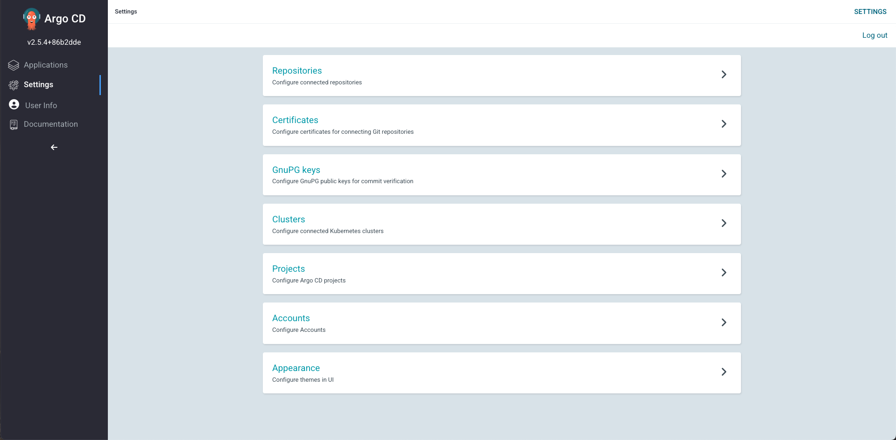
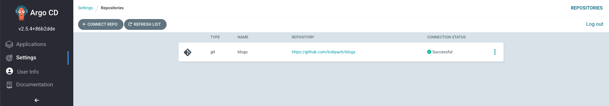
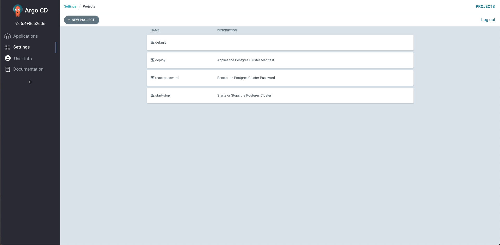
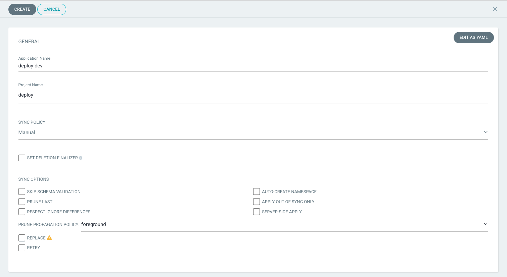
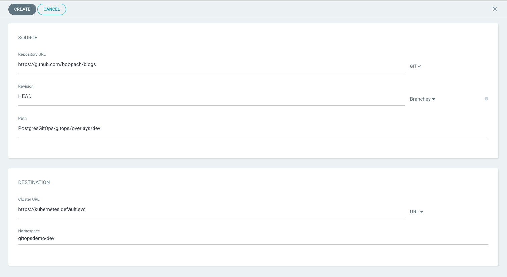
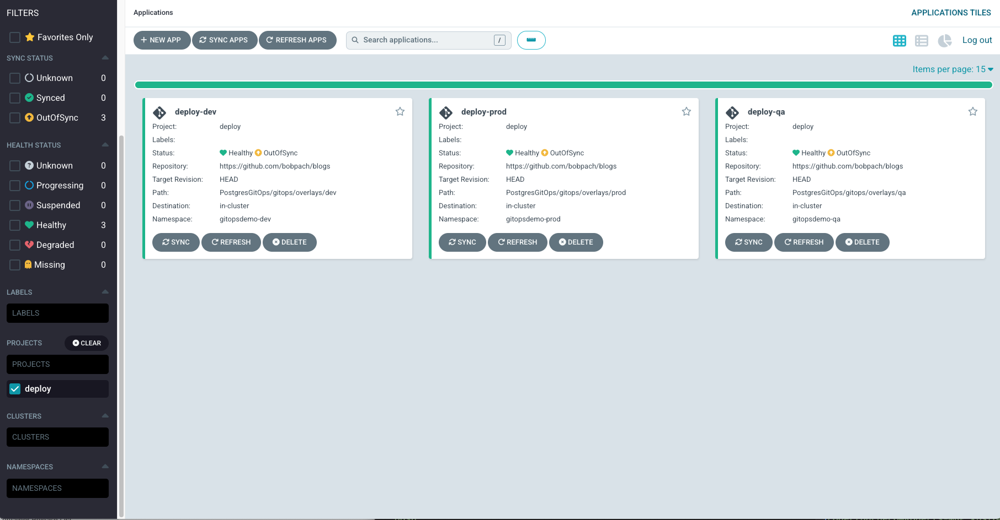
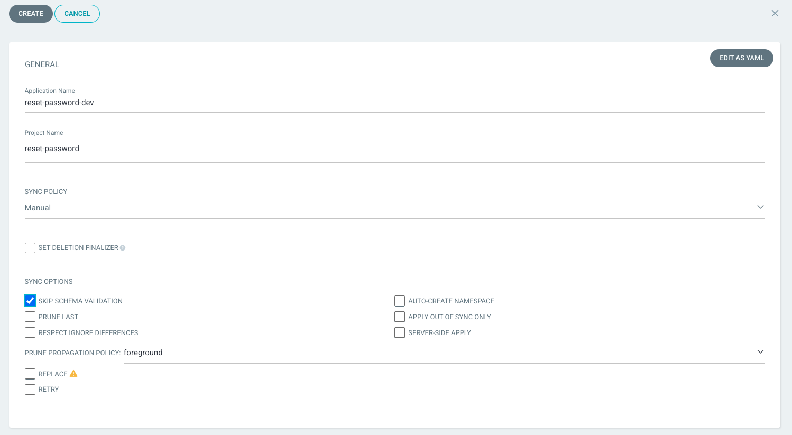
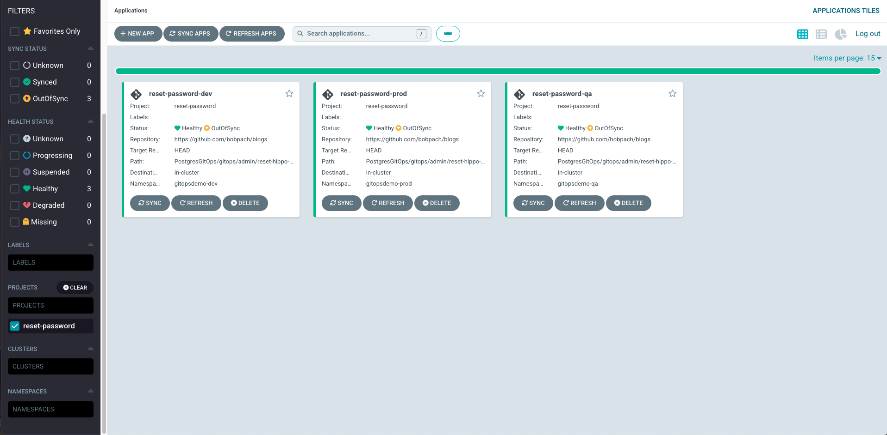
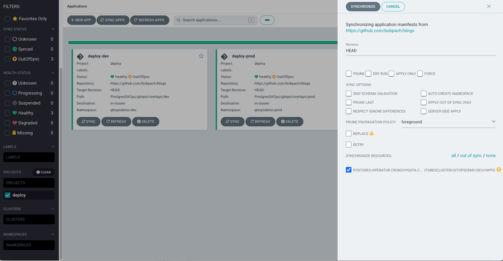
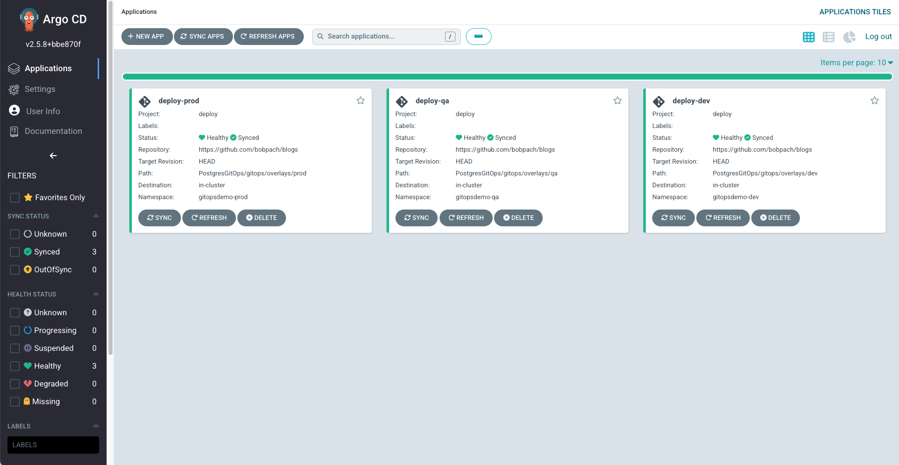

# Day 2 Operations for PostgreSQL Clusters on Kubernetes at Scale

It is critical that Postgres clusters are optimized, updated regularly and have routine maintenance to ensure that the environment stays stable, secure and performant.  The process of achieving this is often referred to as Day 2 operations.  Performing Day 2 operations can be complex and time consuming; especially if you are supporting a large number Postgres clusters.

To date, infrastructure management has mostly been a manual process.  However, with the adoption of [Gitops](https://about.gitlab.com/topics/gitops/) and a little help from a continuos delivery tool like [Argo CD](https://argo-cd.readthedocs.io/en/stable/) you can simplify your Day 2 operations. The declarative nature of Crunchy Postgres for Kubernetes (CPK) makes it a perfect candidate for gitops. Let's take a look at how gitops and Argo CD can help perform Day 2 Operations on your Crunchy Data Postgres cluster on kubernetes.

The examples in this blog assume that you have installed the CPK Postgres Operator v5.2 or later in the same Kubernetes cluster that you will be deploying the PostgreSQL clusters in.  More information on how to deploy the CPK Postgres Operator can be found [here](https://www.crunchydata.com/developers/get-started/postgres-operator):  

## The "Git" in Gitops

In order to perform gitops operations you must check-in your infrastructure files to Git.  Im my github repo I have a file structure that separates the files into admin, base and overlay directories. This structure helps isolate files so they can be independently run via [Kustomize](https://kustomize.io/) in Argo CD.

- PostgresGitOps:
  - gitops:
    - admin:
      - reset-password:
        <details>
          <summary>- kustomization.yaml</summary>

        ``` yaml
        resources:
        - resetpassword.yaml
        ```
        
        </details>

        <details><summary>- resetpassword.yaml</summary>

        ``` yaml
        apiVersion: v1
        data:
          password: 
        kind: Secret
        metadata:
          name: <cluster_name>-pguser-<cluster_name>
        type: Opaque
        ```

        </details>
      - shutdown:
        <details><summary>- kustomization.yaml</summary>

        ``` yaml
        bases:
          - ../../base/postgres
        
        patchesStrategicMerge:
          - postgres.yaml
        ```
        
        </details>
        <details><summary>- postgres.yaml</summary>
        
        ``` yaml
        apiVersion: postgres-operator.crunchydata.com/v1beta1
        kind: PostgresCluster
        metadata:
          name: <cluster_name>
        spec:
          shutdown: true
        ```
        
        </details>
      - startup:
        <details><summary>- kustomization.yaml</summary>

        ``` yaml
        bases:
          - ../../base/postgres
        
        patchesStrategicMerge:
          - postgres.yaml
        ```
        
        </details>
        <details><summary>- postgres.yaml</summary>

        ``` yaml
        apiVersion: postgres-operator.crunchydata.com/v1beta1
        kind: PostgresCluster
        metadata:
          name: <cluster_name>
        spec:
          shutdown: false
        ```
        
        </details>
    - base:
      - postgres:
        <details><summary>- kustomization.yaml</summary>

        ``` yaml
        resources:
        - postgres.yaml
        ```
        
        </details>
        <details><summary>- postgres.yaml</summary>

        ``` yaml
        apiVersion: postgres-operator.crunchydata.com/v1beta1
        kind: PostgresCluster
        metadata:
          name: <cluster_name>
        spec:
          users:
            - name: <cluster_name>
              databases:
                 - <cluster_name>db
          image: registry.developers.crunchydata.com/crunchydata/crunchy-postgres:ubi8-14.5-1
          postgresVersion: 14
          shutdown: false
          port: 5432
          instances:
            - name: 'pgdb'
              replicas: 1
              resources:
                limits:
                  cpu: 1.0
                  memory: 1Gi
              dataVolumeClaimSpec:
                accessModes:
                - "ReadWriteOnce"
                resources:
                  requests:
                    storage: 1Gi

          backups:
            pgbackrest:
              image: registry.developers.crunchydata.com/crunchydata/crunchy-pgbackrest:ubi8-2.40-1
              repos:
              - name: repo1
                volume:
                  volumeClaimSpec:
                    accessModes:
                    - "ReadWriteOnce"
                    resources:
                      requests:
                        storage: 1Gi

          patroni:
            dynamicConfiguration:
              postgresql:
                parameters:
                  max_parallel_workers: 2
                  max_worker_processes: 2
                  shared_buffers: 256MB
                  work_mem: 5MB
                  archive_timeout: 600
        ```
        
        </details>
    - overlays:
      - dev:
        <details><summary>- kustomization.yaml</summary>

        ``` yaml
        bases:
          - ../../base/postgres
        
        patchesStrategicMerge:
          - postgres.yaml
        ```
        
        </details>
        <details><summary>- postgres.yaml</summary>

        ``` yaml
        apiVersion: postgres-operator.crunchydata.com/v1beta1
        kind: PostgresCluster
        metadata:
          name: <cluster_name>
        spec:
          postgresVersion: 14
        ```
        
        </details>
      - prod:
        <details><summary>- kustomization.yaml</summary>

        ``` yaml
        bases:
          - ../../base/postgres
        
        patchesStrategicMerge:
          - postgres.yaml
        ```
        
        </details>
        <details><summary>- postgres.yaml</summary>

        ``` yaml
        apiVersion: postgres-operator.crunchydata.com/v1beta1
        kind: PostgresCluster
        metadata:
          name: <cluster_name>
        spec:
          postgresVersion: 14
          instances:
            - name: 'pgdb'
              replicas: 2
              resources:
                limits:
                  cpu: 1.0
                  memory: 1Gi
              dataVolumeClaimSpec:
                accessModes:
                - "ReadWriteOnce"
                resources:
                  requests:
                    storage: 5Gi

          backups:
            pgbackrest:
              repos:
              - name: repo1
                schedules:
                  full: "0 1 * * 0"
                  incremental: "0 1 * * 1-6"
                volume:
                  volumeClaimSpec:
                    accessModes:
                    - "ReadWriteOnce"
                    resources:
                      requests:
                        storage: 1Gi

          monitoring:
            pgmonitor:
              exporter:
                image: registry.developers.crunchydata.com/crunchydata/crunchy-postgres-exporter:ubi8-5.2.1-0

          proxy:
            pgBouncer:
              image: registry.developers.crunchydata.com/crunchydata/crunchy-pgbouncer:ubi8-1.17-5
              replicas: 2
              affinity:
                podAntiAffinity:
                  preferredDuringSchedulingIgnoredDuringExecution:
                  - weight: 1
                    podAffinityTerm:
                      topologyKey: kubernetes.io/hostname
                      labelSelector:
                        matchLabels:
                          postgres-operator.crunchydata.com/cluster: hippo-ha
                          postgres-operator.crunchydata.com/role: pgbouncer

          patroni:
            dynamicConfiguration:
              postgresql:
                parameters:
                  max_parallel_workers: 2
                  max_worker_processes: 2
                  shared_buffers: 512MB
                  archive_timeout: 600
        ```
        
        </details>
      - qa:
        <details><summary>- kustomization.yaml</summary>

        ``` yaml
        bases:
          - ../../base/postgres
        
        patchesStrategicMerge:
          - postgres.yaml
        ```
        
        </details>
        <details><summary>- postgres.yaml</summary>

        ``` yaml
        apiVersion: postgres-operator.crunchydata.com/v1beta1
        kind: PostgresCluster
        metadata:
          name: <cluster_name>
        spec:
          postgresVersion: 14
          instances:
            - name: 'pgdb'
              replicas: 2
              resources:
                limits:
                  cpu: 1.0
                  memory: 1Gi
              dataVolumeClaimSpec:
                accessModes:
                - "ReadWriteOnce"
                resources:
                  requests:
                    storage: 5Gi

          backups:
            pgbackrest:
              repos:
              - name: repo1
                schedules:
                  full: "0 1 * * 0"
                volume:
                  volumeClaimSpec:
                    accessModes:
                    - "ReadWriteOnce"
                    resources:
                      requests:
                        storage: 1Gi

          monitoring:
            pgmonitor:
              exporter:
                image: registry.developers.crunchydata.com/crunchydata/crunchy-postgres-exporter:ubi8-5.2.1-0
        ```
        
        </details>


In gitops, Git is used as the [Single Source of Truth](https://en.wikipedia.org/wiki/Single_source_of_truth) to manage all infrastructure files.  The files used in the preceding examples manage artifacts to deploy the Postgres clusters and perform declarative Day 2 Operations on them. You can copy and paste the example files into your own files and check them in to your git repo.</br>

***Note:*** Ensure that you replace the ```<cluster_name>``` place holder with your own cluster name and use the same value in all of the example files.

## Argo CD

Argo CD is a declarative, GitOps continuous delivery tool for Kubernetes.  It provides a UI and CLI that makes it easy to deploy and manage your applications running on Kubernetes. To install Argo CD in your kubernetes cluster simply run the following:

``` bash
kubectl create namespace argocd
kubectl apply -n argocd -f https://raw.githubusercontent.com/argoproj/argo-cd/stable/manifests/install.yaml
```

Additional details can be found in their [getting started guide](https://argo-cd.readthedocs.io/en/stable/getting_started/).

To access the Argo CD UI I have changed the argocd-sever service from ClusterIP to LoadBalancer.  This provides and external IP that I can access from my browser.  You could also use a port forward or an ingress.

``` bash
kubectl patch svc argocd-server -n argocd -p '{"spec": {"type": "LoadBalancer"}}'
```

Once you have launched the Argo CD UI you can login.  The initial password for the ***admin*** account can be retrieved from the argocd-initial-admin-secret.

``` bash
kubectl -n argocd get secret argocd-initial-admin-secret -o jsonpath="{.data.password}" | base64 -d; echo
```

### Configuring ARGO CD
Now that you have logged in you are ready to start configuring Argo CD to deploy and manage your Postgres cluster on Kubernetes.  The Argo CD UI should look like this:

#### Add the Git Repository
You need to add your git repository to Argo CD.  Click on 'Settings' in the navigation bar on the left.


Now click on 'Repositories' and the 'Connect Repo' buttons.  Provide the necessary information and click 'Save'.  Your should now have a connected repo.  If not, please review your settings and try again.
 
#### Create the Projects
Argo CD uses projects to logically group applications.  I created three projects:
* deploy
* reset-password
* start-stop
  

To create a project click on 'Settings' in the navigation bar on the left.  Click on 'Project' and then the 'New Project' button.  Provide a project name and description in the panel on the right and click create.
Add your repo to 'Source Repositories' and add your Kubernetes cluster to 'Destinations' as seen here:

***Note:*** For this blog I deployed Argo CD in the same Kubernetes cluster that I am deploying Postgres into.  Please refer to the [Argo CD Documentation](https://argo-cd.readthedocs.io/en/stable/) for other deployment options.

Repeat the steps for each project you want to create.

### Creating Applications
Argo CD uses applications to perform declarative operations on its configured Kubernetes cluster. We will create several applications to deploy Postgres clusters and perform day 2 operations across 3 namespaces.

***Operations***
* deploy-postgres
* start-postgres
* stop-postgres
* reset-password

Create the namespaces in the same kubernetes cluster that you deployed Argo CD into.

``` bash
kubectl create namespace gitopsdemo-dev
kubectl create namespace gitopsdemo-qa
kubectl create namespace gitopsdemo-prod
```

#### Deploy
Let's start with the deploy application.  Click on 'Applications' in the navigation bar on the left.  Click on the 'New App' button.  We will create 'deploy-dev' application.  Notice that I am assigning this to teh deploy project and the gitopsdemo-dev namespace.  I have also added my github repo that I previously registered and I assigned the correct repo path to where the kustomization file resides.



Continue two additional applications for the two remaining namespaces naming them accordingly: deploy-qa, deploy-prod.  When you are done your application list for teh deploy project will look like this:


#### Start / Stop
Now let's create the applications for starting and stopping the postgres cluster in our start-stop project for all three namespaces.  Ensure that you select the correct namespace and the correct github repo path for each application.  Your completed application list for the start-stop project will look like this:


#### Reset Password
The Postgres Operator (PGO) in CPK will automatically recreate a password in a secret it manages if that password is is blanked out ("").  We will use this feature in our next set of applications.  Create a reset-password application in the reset-password project for each namespace.  Again, be mindful to select the proper namespace and github repo path for each application.  These applications will be configure like the previous with one exception.  Check the 'Skip Schema Validation' checkbox.  Kubernetes does not like empty passwords in secrets.  However, the password will be immediately  regenerated with a new random password by the operator.


Your completed application list for the reset-password project will look like this:


## Gitops in Action
You have taken the time to configure Argo CD and setup all of the applications you require  to deploy Postgres clusters and perform day 2 operations.  Now its time to reap the benefits of your efforts.

### Deploy
Click on the 'Sync' button in the deploy-dev application in the deploy project:

Click on the 'Synchronize' button on the right panel.
Now to the same for the deploy-qa and deploy-prod applications.  You will notice that each application is now marked as "Synched'.

I can see that Postgres was deployed and backed when I request the pod list from the three namespaces:

``` bash
robertpacheco@Roberts-MBP kustomize % kubectl -n gitopsdemo-dev get pods
NAME                      READY   STATUS      RESTARTS   AGE
hippo-backup-vh2n-dpw8f   0/1     Completed   0          4m36s
hippo-pgdb-frxt-0         4/4     Running     0          5m30s
hippo-repo-host-0         2/2     Running     0          5m30s

robertpacheco@Roberts-MBP kustomize % kubectl -n gitopsdemo-qa get pods
NAME                      READY   STATUS      RESTARTS   AGE
hippo-backup-s8cw-85kn9   0/1     Completed   0          57s
hippo-pgdb-dfrr-0         5/5     Running     0          75s
hippo-pgdb-n6fh-0         5/5     Running     0          75s
hippo-repo-host-0         2/2     Running     0          75s

robertpacheco@Roberts-MBP kustomize % kubectl -n gitopsdemo-prod get pods
NAME                               READY   STATUS      RESTARTS   AGE
hippo-backup-qwzb-gkb75            0/1     Completed   0          51s
hippo-pgbouncer-7444dc559c-bsjmw   2/2     Running     0          67s
hippo-pgbouncer-7444dc559c-rk992   2/2     Running     0          67s
hippo-pgdb-b5hw-0                  5/5     Running     0          68s
hippo-pgdb-knvc-0                  5/5     Running     0          68s
hippo-repo-host-0                  2/2     Running     0          67s
```

Notice the Postgres cluster differences between namespaces.  The gitopsdemo-dev namespace has one Postgres pod with four containers, a repo host and a completed backup job.  The gitopsdemo-qa namespace has two Postgres pods with five containers each, a repo host and a completed backup job.  The gitopsdemo-prod namespace has two pgBouncer pods in addition to the two postgres pods, repo host and completed backup job.

The use of overlays allows you to standardize you base configuration and then "overlay" that configuration with specific changes.  Take a closer look at the base images and overlays we are using here to see what else has been changed per instance.

The declarative nature of CPK works perfectly with Argo CD to simplify Postgres Cluster deployments the gitops way.
### Start / Stop
Let's stop the dev Postgres cluster.  Select the stop-dev application from the start-stop project.  Click on 'Synch' and then click on 'Synchronize' in the right panel.  You will notice that the application is now marked as 'Synched' and the dev pods have been stopped.  The backup job is still listed as completed.  It was not stopped because as a completed job it was not running.

``` bash
robertpacheco@Roberts-MBP kustomize % kubectl -n gitopsdemo-dev get pods
NAME                      READY   STATUS      RESTARTS   AGE
hippo-backup-vh2n-dpw8f   0/1     Completed   0          58m
```

Now let's start the dev Postgres cluster.  Select the start-dev application from the start-stop project.  Click on 'Synch' and then click on 'Synchronize' in the right panel.  You will notice that the application is now marked as 'Synched' and the dev pods have been started.  You will also notice that the stop-dev job is now marked as 'OutOfSynch' while the start-dev job is marked as 'Synched'.

``` bash
robertpacheco@Roberts-MBP kustomize % kubectl -n gitopsdemo-dev get pods
NAME                      READY   STATUS      RESTARTS   AGE
hippo-backup-vh2n-dpw8f   0/1     Completed   0          61m
hippo-pgdb-frxt-0         4/4     Running     0          18s
hippo-repo-host-0         2/2     Running     0          18s
```

Try this with the qa and prod applications as well.  It becomes very easy to start or stop a postgres cluster when needed using gitops.

### Reset Password
You security team has decided its time to reset the password for the initial user created at deploy time. First lets determine what the current password is so we can validate that the change took place.

``` bash
kubectl -n gitopsdemo-dev get secret <cluster_name-pguser-cluster_name> -o jsonpath="{.data.password}" | base64 -d; echo
```

Make a note of that password.  Select the reset-password-dev application from the reset-password project.  Click on 'Synch' and then click on 'Synchronize' in the right panel.  In this case the status of the application stays listed as 'OutOfSynch' because the operator immediately assigned a new randomly generated password after it was blanked out.  Let's run ths same command again.

``` bash
kubectl -n gitopsdemo-dev get secret <cluster_name-pguser-cluster_name> -o jsonpath="{.data.password}" | base64 -d; echo
```

You will notice that the password has been updated.  Try this with the qa and prod applications as well.  Changing the Postgres password has never been easier.
### Postgres Upgrade
The PostgreSQL open source community typically releases a new major.minor version of Postgres every quarter.  These releases will contain bug fixes and CVE fixes.  Crunchy Data takes these updates and updates their container images accordingly. It is considered a best practice to take these updates into your Postgres clusters running on Kubernetes as quickly as possible to apply CVE remediations and bug fixes.

Let's check the current Postgres version in the dev cluster:

Using Argo CD and Gitops we will declaratively state our intent by updating the images in our deployment artifacts in git.  Let's take a closer look.

In the postgres.yaml file in our base/postgres directory we have to images:
* Postgres: image: registry.developers.crunchydata.com/crunchydata/crunchy-postgres:ubi8-14.5-1
* pgBackrest: image: registry.developers.crunchydata.com/crunchydata/crunchy-pgbackrest:ubi8-2.40-1

Update that file with the latest images for the same major version:
* Postgres: image: registry.developers.crunchydata.com/crunchydata/crunchy-postgres:ubi8-14.6-0
* pgBackrest: image: registry.developers.crunchydata.com/crunchydata/crunchy-pgbackrest:ubi8-2.41-0

Once you check these changes into your github repo click the 'Refresh Apps' button at the top of the applications screen for the deploy project.  You will see that the applications in the deploy project are now listed as 'OutOfSynch'.

``` bash
robertpacheco@Roberts-MBP ~ % kubectl exec -n gitopsdemo-dev hippo-pgdb-frxt-0 -c database -it -- bash
bash-4.4$ psql
psql (14.5)
Type "help" for help.

postgres=# select version();
                                                 version

---------------------------------------------------------------------------------------------------------
 PostgreSQL 14.5 on x86_64-pc-linux-gnu, compiled by gcc (GCC) 8.5.0 20210514 (Red Hat 8.5.0-10), 64-bit
(1 row)

```

Select the deploy-dev application from the deploy project.  Click on 'Synch' and then click on 'Synchronize' in the right panel. 

When you synchronize the Postgres Operator will bring down the repo host and a postgres replica pod.  Those pods will immediately be restarted with the new images.  Each Postgres replica pod will be upgraded one at a time until just the primary pod is left.  The primary pod will then automatically failover to a recently upgraded replica pod and will then restart with the new image coming back up as a replica.  If you only have one postgres postgres pod, as we do in teh dev cluster, that pod immediately gets upgraded.

You will notice that the deploy-dev application is now marked asd 'Synched'.

Lets check the Postgres version now.
``` bash
robertpacheco@Roberts-MBP ~ % kubectl exec -n gitopsdemo-dev hippo-pgdb-frxt-0 -c database -it -- bash
bash-4.4$ psql
psql (14.6)
Type "help" for help.

postgres=# select version();
                                                 version

---------------------------------------------------------------------------------------------------------
 PostgreSQL 14.6 on x86_64-pc-linux-gnu, compiled by gcc (GCC) 8.5.0 20210514 (Red Hat 8.5.0-15), 64-bit
(1 row)
```

Using this approach allows you to test your upgrade in the dev cluster before applying it to qa and prod.  Once you feel confident that the postgres cluster and its consumers are working as expected you can synchronize the deploy-qa application and then once qa testing is complete you can synchronize the deploy-prod application.

You changed the images in one file and were able to upgrade all three Postgres clusters thanks to Argo CD and gitops.

## Summary
Crunchy Postgres for Kubernetes is a powerful tool to rapidly deploy Postgres clusters in any Kubernetes environment.  The declarative nature of CPK makes it a perfect candidate for gitops.  Administrative responsibilities don't stop once the deployment is complete.  Being able to perform day 2 operations at scale is crucial to ensure the security and stability of your Postgres clusters.  Argo CD and gitops can simplify the day to day operations needed by your enterprise deployments.